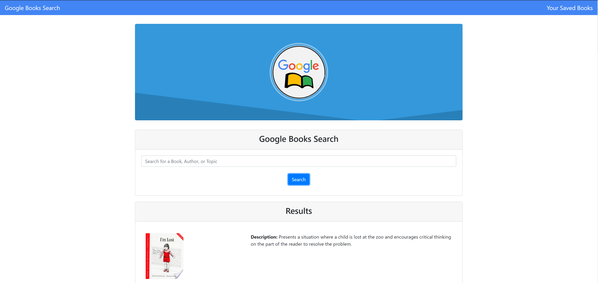
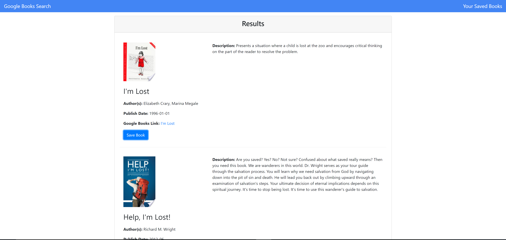
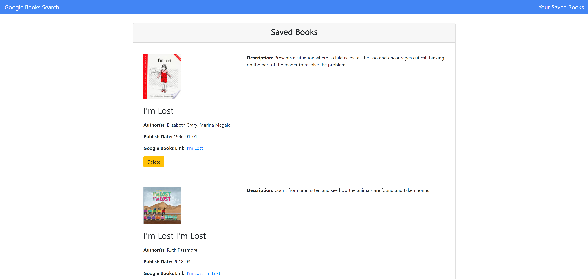

# React Google Books Search

# Project Description

GoogleBookSearchApp is a React-based Google Books Search app that allows users to search for books via the Google Books API. Users have the option to "Save" a book, saving it to the Mongo database. Users have the option to "View" the book, bringing them to the book on Google Books, or "Delete" a book, removing it from the Mongo database.

GoogleBookSearchApp uses React to create React components, works with helper/util functions, and utilizes React lifecycle methods to query and display books based on user searches. Node, Express, and MongoDB are also used so that users can save books to review or purchase later. Bootstrap is used for the styling.

# Technologies Used

* React
* ES6
* Express.js
* Node.js
* NPM packages: React-router, Express, Axios
* MongoDB
* Bootstrap
* CSS

# GoogleBooksSearchApp Live Link

GoogleBooksSearchApp is deployed to Heroku. Please check it out here:

# Screenshots

